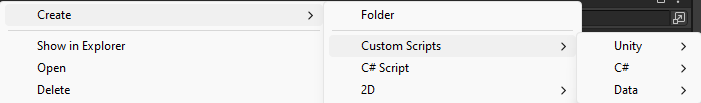

# Unity Script Templates

This package includes script templates for my Unity projects.

## :grey_question: What is a script template in Unity?

A script template is a pre-defined file that contains the basic structure of a script. It can save you time by providing the basic structure of a script and help you to create consistent code by providing a standard template to follow.

## :hammer_and_wrench: How to install?

- [Download package](https://github.com/NguyenKietttt/Unity-Script-Template/releases)
- Delete the old `ScripTemplates` folder if you have it.
- Import the package into your project.
- You will need to close and restart Unity for the changes to take effect.

You can now see the new script creation menu when you right-click in the `Project` view.

## :warning: Notice
The `ScripTemplates` folder will not work unless you put it inside the `Assets` folder.
- Assets/ScripTemplates :white_check_mark:
- Assets/SomeFolder/ScripTemplates :x:
